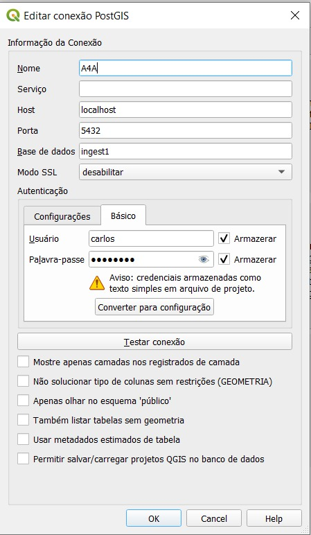
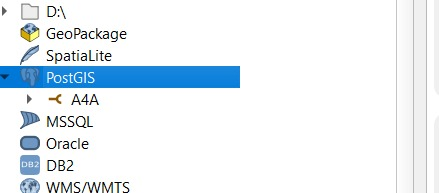

# Usando o Quantum-GIS na A4A

[QGIS](https://en.wikipedia.org/wiki/QGIS) é uma das ferramentas eleitas pelo Instituto AddressForAll (A4A) para efetivar seus propósitos e instrumentalizar a sua equipe e comunidade.

É um software livre de SIG ([sistema de informação geográfica](https://pt.wikipedia.org/wiki/Sistema_de_informa%C3%A7%C3%A3o_geogr%C3%A1fica)) que, em particular:

* Roda nos sistemas **Ubuntu** e **Windows**;

* Abre arquivos **GeoJSON** e conecta com banco de dados **PostreSQL**. 

A presente documentação tem como escopo apenas os elementos destacados em negrito.

## Conexão com server

QGIS com servidor online da AddressForAll... requer conexão SSH por segurança... e a técnica de "tunel"...

* Acesso direto ao banco de dados: não é seguro, exceto talvez para áreas de "sandbox". São áreas temporárias e não aceitas como "de produção", pois a transferência de dados fica comprometida. No caso de visualização (read-only) requer configuração... 

* Acesso por [protocolo de tunelamento](https://pt.wikipedia.org/wiki/Protocolo_de_tunelamento) seguro: envolve o uso do protocolo de acesso seguro, que atualmente é o SSH, ou seja, [Secure SH tunneling](https://en.wikipedia.org/wiki/Tunneling_protocol#Secure_Shell_tunneling). Pode ser muito pesado para a visualização de grandes porções de dados.

### No Ubuntu

A conexão SSH por terminal e com tunelamento local pode ser feita usando os recursos do comando POSIX `ssh`, conforme instruções do seu Guia oficial [OpenSSH/PortForwarding/Local Port Forwarding](https://help.ubuntu.com/community/SSH/OpenSSH/PortForwarding#Local_Port_Forwarding). Trata-se do SSH tunnel que fica registrado na sua máquina como `localhost:port`, também explicado nesta [resposta AskUbuntu](https://askubuntu.com/a/539953/439867).

... Um tunel para usuário A4A:

`ssh -L localhost:5432:localhost:5432 -o ServerAliveInterval=5 fulano@addressforall.org`

... No qgis, botão direito no postgis, nova conexão

...
 
### No Windows

Apesar do sistema operacional preferencial da A4A ser o Linux, para usuários finais é dada a opção de, em tarefas menos crítcas, usar o Windows. 

A visualização de dados por QGIS é uma destas tarefas, mas ainda assim se for conectar com o servidor online, são solicitaods critérios adicionais de segurança e isolamento do Windows. Usuários Windows possuem a **restrição de acesso apenas para leitura**.
 
Como o Windows não tem um ambiente de sistema interoperável, seu terminal (tela preta DOS) não realiza as tarefas mínimas de interoperabilidade de sistemas abertos.
A solução é usar uma das ferramentas complementares, que podem ser o antigo [PuTTY](https://www.putty.org/) ou o moderno [MobaXterm](https://mobaxterm.mobatek.net/), que oferece também SFTP integrado. Na A4A optamos pelo Moba.

...

